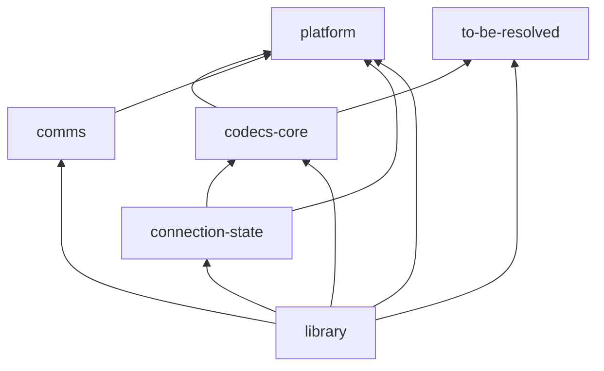
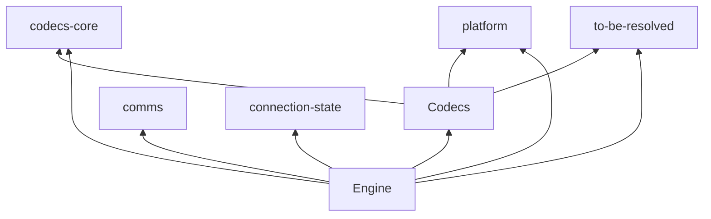

# AGENTS.md

Instructions for coding agents working in this repo.

Companion documents:

- [CONTEXT.md](CONTEXT.md) - glossary of the domain language (Statement, Params, OID cache, statement cache, …). Read it before naming anything; naming that contradicts the glossary is a defect.
- <https://github.com/nikita-volkov/haskell-coding-standards> - the general Haskell design system this project follows (imports, exports, naming, errors, deriving, formatting, documentation, architecture patterns). This file records only what is *specific to hasql*; for anything general, defer to the standards repo.

## Project Overview

Hasql is a fast PostgreSQL driver with a flexible mapping API. It is the root of a granular ecosystem of composable libraries, each staying simple and doing one thing. The project favours modularity, type safety, and explicit error handling over exceptions.

### Ecosystem Approach

- **Modular design** - an ecosystem of small focused libraries rather than one monolith.
- **Horizontal scalability** - users are encouraged to write extension libraries rather than grow the core.
- **Composability** - each library exposes a simple API that combines with the others.
- **Interchangeability** - several libraries may solve the same problem in different ways.

### Key Abstractions

- **Connection** - manages a database connection, its settings, OID cache and statement cache.
- **Session** - a batch of actions executed in a connection context. `Hasql.Engine.Contexts.Session` derives its instances `via (ExceptT SessionError (StateT ConnectionState IO))`.
- **Pipeline** - composable abstraction for executing several queries in one round trip.
- **Statement** - a single SQL query plus its parameter encoder and result decoder.
- **Encoders** - DSL for declaring parameter encoders (Params, Value, NullableOrNot).
- **Decoders** - DSL for declaring result decoders (Result, Row, Value, NullableOrNot).

### Layers

The codebase is layered along two axes: cabal components, and namespaces inside the `library` component. Allowed dependency edges:

| Layer | May depend on |
|---|---|
| `platform` | — |
| `to-be-resolved` | — |
| `codecs-core` | `platform`, `to-be-resolved` |
| `comms` | `platform` |
| `connection-state` | `codecs-core`, `platform` |
| `Hasql.Codecs.*` | `codecs-core`, `platform`, `to-be-resolved` |
| `Hasql.Engine.*` | `Hasql.Codecs.*`, `codecs-core`, `comms`, `connection-state`, `platform`, `to-be-resolved` |

`codecs-core`, `comms`, `connection-state`, `to-be-resolved` and `platform` are separate cabal components; `Hasql.Codecs.*` and `Hasql.Engine.*` are namespaces inside the `library` component. Namespaces not listed (`Hasql.Connection.*`, the top-level public modules) are deliberately left unconstrained.

Cabal components:



`Hasql.*` namespaces within the `library` component:



- `Platform/` - the custom prelude and shared primitives.
- `Codecs/` - encoder and decoder DSLs.
- `Comms/` - protocol round trips and result decoding, on top of the libpq binding.
- `Engine/` - statement compilation, result/row decoding, and contexts (Session, Pipeline) that drive `connection-state`.
- Top-level modules (`Hasql.Connection`, `Hasql.Session`, …) are the public API.

Postgres itself is reached through the external [pqi](https://github.com/nikita-volkov/pqi) library, which abstracts over interchangeable adapters (`pqi-ffi`, `pqi-native`). Hasql does not carry its own libpq bindings - do not reintroduce any.

## Code Style & Conventions

### Language Extensions

Defined once in the `common base` stanza of [hasql.cabal](hasql.cabal) and imported by every component. Consult that stanza rather than assuming; do not add a per-module `{-# LANGUAGE #-}` pragma for an extension that belongs in the shared list.

### Imports

- **Qualified imports** for everything except the module's own topic - e.g. `qualified as Encoders`, `qualified as Decoders`.
- Qualify by the module's topic, not by an arbitrary abbreviation. Self-qualified form (`import Pqi.Ffi qualified`) is preferred where the name is already short.
- **Custom prelude** - every library module imports `Hasql.Platform.Prelude`, never the standard `Prelude`. Outside the library the convention follows the layer under test: `comms-tests` uses `Hasql.Platform.Prelude`; `library-tests`, `engine-tests`, `benchmarks` and `profiling` use plain `Prelude`.

### Naming

- **Newtype wrappers** are used extensively for type safety (Session, Statement, Connection). Prefer a newtype over a raw primitive whenever the value carries a domain meaning - a bare `Word32` that is really an OID, or an `Int32` that is really a row index, is a defect.
- **DSL style** for encoders and decoders.
- Clear, descriptive type signatures; phantom types where they earn their keep.

### Error Handling

- **No exceptions** in the public API - explicit `Either` with a custom error ADT.
- Exceptions are reserved for genuinely unrecoverable state.

### Applicative Syntax

Prefer `do` notation with `ApplicativeDo` for clarity in applicative contexts.

### Function Application and Chaining

- Avoid `$` for function application; prefer parentheses.
- When chaining rather than nesting, use `.` and wrap the chain in parentheses so Ormolu does not split it across lines:

  ```haskell
  (TextBuilder.toText . mconcat)
    [ ... ]
  ```

- `&` is acceptable.

### Constructing Text

- Use `TextBuilder` from the "text-builder" library.
- Prefer `mconcat` over a series of `(<>)`.
- Use `(TextBuilder.toText . mconcat)` to build and convert in one step.

### Documentation

- Haddock `-- |` on every module and every exported definition.
- Document the why and the contract, not the what.
- Include practical examples where they help.
- Explicit export lists on all modules.

## Tests

`src/library-tests` is organised by what a test needs from the environment:

- `Pure/` - no database at all.
- `Integration/Sharing/` - safe to run against a shared database. The shared hook (`Integration/Sharing/SpecHook.hs`) starts one container per Postgres distro and hands each spec a `Scripts.ScopeParams` triple of adapter, host and port.
- `Integration/Isolated/` - needs its own database or its own connection lifecycle.

`Integration/SpecHook.hs` sits above both integration categories and iterates the pqi adapters once, so every integration spec runs against `pqi-ffi` and `pqi-native` alike. `Pure/` is outside that hook, since it needs no adapter.

Within each category, modularize by the unit under test - see `src/library-tests/README.md` for the full policy on `[Module]Spec.hs` vs `[Module]/[Definition]Spec.hs` vs `[Module]/[Definition]/[Case]Spec.hs`. There is no `ByFeature/` or `ByBug/`; every test, including regression reproductions, is filed under the module/definition it exercises.

Other components: `comms-tests` and `engine-tests` cover the internal layers directly; `benchmarks` and `profiling` are separate executables.

## Build System

- Cabal; library, test suites and benchmarks are separate components sharing the `base`, `executable` and `test` common stanzas.
- Ormolu is the formatter. Run it on changed `.hs` files before committing.
- Requires libpq 14+ headers to build the `pqi-ffi` adapter.

## Extension Libraries

New functionality usually belongs outside the core. Consider:

- **hasql-th** - Template Haskell utilities and compile-time checking
- **hasql-transaction** - STM-inspired transaction management
- **hasql-dynamic-statements** - dynamic statement generation
- **hasql-cursor-query** - cursor-based query abstractions
- **hasql-implicits** - implicit definitions and default codecs
- Or a new focused extension library
